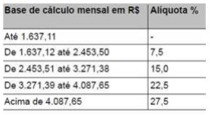

# Exercício - Cálculo de Imposto de Renda

Escreva um programa, em linguagem C, que:

a) Solicite ao usuário a entrada de um registro que armazene na memória o nome do funcionário e o seu salário.

b) Utilizando o salário informado calcule o imposto de renda devido e mostre na tela, conforme a tabela abaixo:

